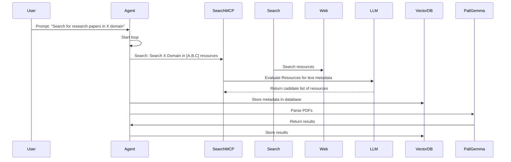

# ragdoll

`ragdoll` is a Agentic LLM RAG copilot research assistant to find, collect, index and chat over LLM/ML research papers.

## Features

- Given a prompt containing the field, searches for LLM/ML research papers and stores them in a vector database
- Provides a chat interface to talk about the the field and provide answers to questions on research papers

## Architecture 

Agent: Runs on a cron job to query an configurable LLM, search the internet for papers and store an embedding in a vector DB
Chat: Performs semantic search on the DB and performs RAG for data stored in the DB. 

## Setup

Postgres pg_vector to store metadata about the paper in a vector embedding for semantic search
PaliGemma

## Components

- Agent: orchestrates actions
- SearchMCP: Search web resources and returns to agent https://github.com/modelcontextprotocol/python-sdk
- Evaluator LLM: Evaluates metadata of returned resources https://huggingface.co/meta-llama/Llama-3.2-1B
- Vector DB (Metadata): Stores results metadata for searching https://qdrant.tech/documentation/quickstart/
- PaliGemma: Parses Research papers and returns for adding to DB https://huggingface.co/vidore/colpali-v1.3

## Development Plan

- Create the scaffold of the Agent loop, stubbing out each of the components

### State Machine
The Agent works in a State Machine model in that we have States and Transition between states. 

State -> Transition
- Initalised -> Searching -> Resources Collected
- Resources Collected -> Evaluating -> Resources Evaluated
- Resource Evaluated -> Storing Metadata -> Resources Metadata Stored
- Resources Metadata Stored -> Parsing Resource -> Resource Parsed

Searching: fetches potential papers from arxiv

